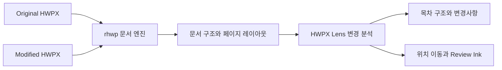

<p align="center">
  
</p>

<h1 align="center">HWPX Lens</h1>

<p align="center">
  <strong>원본 문서의 모양은 그대로, 달라진 곳은 빠르게.</strong><br>
  두 개의 HWPX 문서를 나란히 보고 변경사항을 검토하는 오프라인 Windows 앱입니다.
</p>

<p align="center">
  <a href="https://github.com/madmanforces/HWPX-Lens/releases/tag/v0.1.0"></a>
  
  
  
  <a href="LICENSE"></a>
</p>

> **현재 단계: 공개 알파(Public Alpha)**
>
> 실제 업무에 적용하기 전, 원본 문서와 표시 결과가 일치하는지 반드시 확인해 주세요.

## HWPX Lens는 무엇인가요?

HWPX Lens는 버전이 다른 두 HWPX 문서를 실제 페이지 형태로 나란히 열고, 달라진 내용을 찾아주는 비교·검토 도구입니다.

문서를 단순 텍스트로 바꿔 비교하지 않습니다. 문단, 목차, 표, 이미지와 같은 문서 구조를 분석하면서도 사용자는 원본과 비슷한 페이지 위에서 변경 위치를 확인할 수 있습니다.

**HWPX 파일은 외부 서버로 전송하지 않습니다.** 문서 열기, 분석, 비교, 화면 표시가 모두 사용자의 PC 안에서 이루어집니다.

## 이런 작업을 더 편하게 만듭니다

| 기능 | 설명 |
| --- | --- |
| 좌우 문서 비교 | Original과 Modified 문서를 실제 페이지 형태로 나란히 표시합니다. |
| 목차 구조와 변경사항 | 두 문서의 목차를 하나의 구조로 정리하고, 변경 종류와 건수를 보여줍니다. |
| 변경 위치 바로가기 | 변경사항을 누르면 양쪽 문서의 실제 대응 위치로 이동합니다. |
| Review Ink | 변경된 문자 범위를 반투명 형광펜처럼 표시하고, 띄어쓰기·붙여쓰기 변화는 별도 교정 기호로 보여줍니다. |
| 표 변경 검토 | 셀 내용과 표 구조의 변화를 구분하고 해당 영역을 강조합니다. |
| 이미지 변경 검토 | 캡션 이미지와 기타 이미지를 구분하여 추가·삭제·변경을 확인합니다. |
| 분리 가능한 검토창 | 목차와 변경사항 패널을 별도 창으로 분리해 넓은 화면이나 두 번째 모니터에서 사용할 수 있습니다. |
| 큰 문서 대응 | 문서 전체는 먼저 분석하고, 화면 주변 페이지만 필요할 때 렌더링합니다. |

## 사용 방법

1. [Releases](https://github.com/madmanforces/HWPX-Lens/releases)에서 최신 Windows 설치파일을 내려받아 설치합니다.
2. 왼쪽에 원본 HWPX, 오른쪽에 수정된 HWPX 파일을 선택합니다.
3. 분석이 끝나면 `목차 구조` 또는 `변경사항`을 눌러 달라진 위치를 확인합니다.

모든 핵심 기능은 인터넷 연결 없이 사용할 수 있습니다.

## 어떻게 동작하나요?



HWPX Lens는 [`@rhwp/core`](https://github.com/edwardkim/rhwp)를 단순한 SVG 변환기로만 사용하지 않습니다. 로컬 문서 엔진으로 활용하면서, Lens는 두 문서를 연결하고 검토하기 좋은 사용자 경험을 만드는 데 집중합니다.

### rhwp가 담당하는 부분

- HWPX 파싱과 문서 모델
- 페이지 레이아웃과 페이지 나누기
- SVG 렌더링 및 실험적 Canvas2D 렌더링 경로
- 문단·표·이미지 등 문서 객체 조회
- 문자 위치, 선택 영역과 복사용 텍스트를 위한 의미 기반 상호작용 API
- 로컬 WASM 기반 문서 처리

### HWPX Lens가 담당하는 부분

- Original과 Modified 문서 세션 관리
- 텍스트·목차·표·이미지 변경 분석
- 양쪽 문서의 변경 위치 연결
- 변경사항 탐색과 페이지 이동
- 원본 레이아웃을 바꾸지 않는 Review Ink 오버레이
- 페이지 가상화, 렌더 캐시와 분석 캐시
- 비교·검토에 집중한 데스크톱 UX

현재 기본 렌더러는 SVG이며 Canvas2D는 실험 경로로 유지합니다. `@rhwp/core`는 `packages/hwpx-adapter` 안에 격리되어 있어, Lens Core와 UI가 특정 렌더러의 DOM 구조에 직접 의존하지 않도록 설계했습니다. rhwp Studio의 비공개 비교 코드는 복사하거나 포함하지 않습니다.

## 오프라인과 개인정보

- 문서 업로드 없음
- 외부 API 서버 없음
- 로그인과 계정 없음
- 원격 폰트·스크립트·스타일 없음
- 분석 정보의 외부 전송과 텔레메트리 없음
- 분석 캐시는 메모리에만 유지되며 앱 세션과 함께 정리

배포 파일에는 앱 실행에 필요한 JavaScript와 rhwp WASM이 함께 포함됩니다.

## 현재 지원 범위와 한계

v0.1.0은 첫 Public Alpha입니다.

- SVG가 기본 렌더러이며 Canvas2D는 진단·실험용입니다.
- 이미지 변경은 원본 리소스의 SHA-256과 문서 메타데이터를 활용합니다. 이미지 내부의 달라진 픽셀 영역까지 판별하지는 않습니다.
- 드문 문서 객체, 복잡한 벡터 이미지 또는 특수 레이아웃은 원본 프로그램과 다르게 보일 수 있습니다.
- 스타일 전용 비교, 문서 편집, 변경 수락·거절, 클라우드 동기화와 협업 기능은 아직 제공하지 않습니다.

문제가 보인다면 재현 가능한 공개용 HWPX와 함께 [Issue](https://github.com/madmanforces/HWPX-Lens/issues)를 남겨주세요. 민감하거나 식별 가능한 내용이 포함된 실제 문서는 업로드하지 마세요.

## 개발하기

### 준비물

- Node.js 22 이상
- Rust 툴체인
- Windows WebView2 빌드 환경

```powershell
git clone https://github.com/madmanforces/HWPX-Lens.git
cd HWPX-Lens
npm install
npm run dev
```

검증과 Windows 설치 빌드:

```powershell
npm run verify
npm run test:e2e
npm run tauri:build
```

`npm run build`와 `npm run tauri:build`는 항상 공개용 일반 문서 프로필을 사용합니다. 실제 문서와 개인 설정 파일은 Git이 추적하지 않는 로컬 경로에서만 관리해 주세요.

## 프로젝트 구조

```text
apps/desktop          Tauri 2 + Vite 데스크톱 앱
packages/lens-core    렌더러에 독립적인 문서·변경 모델과 비교 로직
packages/hwpx-adapter rhwp 공개 API와 HWPX Lens 사이의 어댑터
packages/lens-ui      React 기반 비교·검토 UI
tests                 합성 HWPX fixture와 통합/E2E 테스트
vendor                검증된 로컬 rhwp WASM과 패치 정보
```

현재 번들은 `@rhwp/core@0.8.6`과 호환되는 로컬 WASM을 사용합니다. 캡션 자동번호 표시를 위한 패치의 출처, 체크섬, 라이선스와 변경 내용은 `vendor/rhwp-0.8.6-hwpx-lens/`에 기록되어 있습니다.

## 문서와 참여

- [기여 안내](CONTRIBUTING.md)
- [보안 정책](SECURITY.md)
- [변경 기록](CHANGELOG.md)
- [서드파티 고지](THIRD_PARTY_NOTICES.md)

HWPX Lens는 [MIT License](LICENSE)로 배포됩니다. HWPX 파싱·레이아웃·렌더링 기반을 제공하는 [rhwp](https://github.com/edwardkim/rhwp) 프로젝트와 기여자들에게 감사드립니다.
